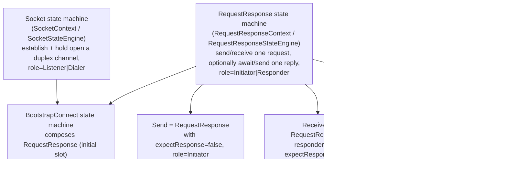

# Toward a Compositional State Machine Hierarchy: Design Investigation

## Direct answer: has the hierarchy actually been reduced?

**No - not structurally.** Steps 1-4 (this branch) eliminated *logic*
duplication (the create/load decision, the merge mechanism, the hello/
response wire framing) but left the *class* hierarchy exactly as it was
before: 11 separate state-machine files, each with its own `Context`/
`StateEngine` pair and near-identical state-transition shapes:

| File | Context | Engine | Role |
|---|---|---|---|
| `ConnectionStateMachine` | `ApiConnContext` | `ConnStateEngine` | establish one link/connection |
| `ListenStateMachine` | `ApiListenContext` | `ListenStateEngine` | channel-mode listener |
| `DialStateMachine` | `ApiDialContext` | `DialStateEngine` | channel-mode dialer |
| `ConduitStateMachine` | `ConduitContext` | (engine in `.cpp`) | open duplex read/write channel |
| `PreConduitStateMachine` | `PreConduitContext` | `PreConduitStateEngine` | channel-mode accept -> Conduit handoff |
| `SendStateMachine` | `ApiSendContext` | `SendStateEngine` | one-shot fire-and-forget send |
| `ReceiveStateMachine` | `ApiRecvContext` | `RecvStateEngine` | one-shot fire-and-forget receive |
| `SendReceiveStateMachine` | `ApiSendReceiveContext` | `SendReceiveStateEngine` | send a request, wait for a reply |
| `BootstrapListenStateMachine` | `ApiBootstrapListenContext` | `BootstrapListenStateEngine` | bootstrap listener |
| `BootstrapDialStateMachine` | `ApiBootstrapDialContext` | `BootstrapDialStateEngine` | bootstrap dialer |
| `BootstrapPreConduitStateMachine` | `BootstrapPreConduitContext` | `BootstrapPreConduitStateEngine` | bootstrap accept -> response -> Conduit handoff |

This is exactly the "three separate classes with near-identical
state-transition tables" flagged as unresolved in `Step4.md` problem #5.
The good news, confirmed by this investigation (see below), is that the
underlying framework is *already* generic enough that a real compositional
collapse is more tractable than `Step4.md` estimated - the earlier claim
that it would "touch plumbing used by every state machine in the SDK" was
too pessimistic. This document corrects that and lays out a concrete path.

## The framework is already generic enough for this

Two facts, confirmed by reading `StateMachine.h` and `ApiManager.cpp`,
make composition straightforward rather than invasive:

1. **`ApiManagerInternal::activeContexts` is a single polymorphic
   `unordered_map<RaceHandle, unique_ptr<Context>>`.** Every `newXContext()`
   factory (`newConnContext`, `newListenContext`, `newBootstrapDialContext`,
   ...) does the exact same thing: construct the concrete context, store it
   in `activeContexts`, return a handle. Adding a new context/engine type is
   adding one more `newXContext()` factory + `startXStateMachine()` method -
   it does not require touching the existing ones.
2. **`ApiContext` is one big virtual base with no-op default
   implementations** for every `update*` callback
   (`updateConnStateMachineConnected`, `updateConnStateMachineLinkEstablished`,
   `update*StateMachineStart`, etc.). Parent/child composition already works
   by: parent calls `manager.startXStateMachine(parentHandle, ...)`, gets a
   child handle back, and later the child's completion is delivered to the
   *parent's* `update*` override (dispatched via
   `on*StateMachineXForContext` in `ApiManager.cpp`, which `dynamic_cast`s
   the parent context to the specific type it expects). This is precisely
   the "spawn a child, get notified via a virtual callback" idiom already
   used by `startConnStateMachineBidi`, `startPreConduitStateMachine`,
   `startBootstrapPreConduitStateMachine`, etc. Two new composed primitives
   fit this idiom exactly; no new mechanism needs inventing.

So the real cost of a compositional collapse is **new code + migration
risk**, not "invasive shared-plumbing changes." That said, the migration
risk is real and demonstrated (Step 3's revert history) - see "Migration
strategy" below.

## Target architecture: 4 primitives

Mapping the requested hierarchy onto the framework:

### 1. `Socket` (establish + hold open a full-duplex channel)

Generalizes `ListenStateMachine` + `DialStateMachine` + `ConduitStateMachine`
(+ non-bootstrap `PreConduitStateMachine`'s accept-to-Conduit handoff).
Parameterized by:
- `role: Listener | Dialer` (who creates vs. loads, resolved via the
  existing `resolveBidiRole(ModeRole)` for merged channels, or the
  channel's own asymmetric manifest property otherwise)
- channel config (single merged channel, or separate send/recv channels)
- `acceptStrategy: NativeMultiplex | ManufacturedMultiplex` (the
  already-identified but still-implicit `link-management.md` §5.5 concept -
  making this explicit is what lets a single `Socket` engine subsume both
  `ListenStateMachine`'s racebird-native-accept path and its
  decomposed-exemplars-manufactured-multi-accept path, currently two
  different hand-written code paths in the same file)

Once established (one or more `ConnectionStateMachine` children opened via
`Socket::establish`, per Steps 1-4), a `Socket` instance behaves like today's
`Conduit`: exposes `read`/`write`/`close` to its owner, and for the Listener
role, an ongoing stream of "new peer accepted" events (replacing today's
`acceptCb` queueing in `ApiListenContext`/`ApiBootstrapListenContext`,
which are otherwise near-identical).

### 2. `RequestResponse` (one request, an optional matching reply)

Generalizes `SendReceiveStateMachine` (Initiator: send request, wait for
reply) and formalizes the Responder side that today only exists informally
(spread across `ListenStateMachine`'s dial-message parsing + app-level
`receiveRespond`, and fully as `BootstrapPreConduitStateMachine`'s
`SendResponse` state). Built directly on the `RoundTrip` message-framing
helper already introduced in Step 4 - `RoundTrip::buildMessage`/
`parseMessage` become this state machine's *implementation detail*, not a
free function every caller has to remember to call correctly. Parameterized
by:
- `role: Initiator | Responder`
- `expectResponse: bool`

### 3. `Send` = `RequestResponse` with `expectResponse = false`, `role = Initiator`

Exactly the request-side degenerate case: build and send one message, no
wait for a reply. `SendStateMachine` becomes a thin factory function
(`startSend(...)`) that constructs a `RequestResponseContext` with
`expectResponse = false` instead of its own `Context`/`StateEngine` pair.
Symmetrically, `ReceiveStateMachine`'s "just receive one message, no reply"
case is the Responder-side degenerate case (`expectResponse = false`,
`role = Responder`).

### 4. `BootstrapConnect` = `Socket` composed with `RequestResponse`

The full bootstrap-connect flow becomes: run a `RequestResponse` exchange
over the "initial" link config (hello/response, `role` = Initiator on the
dial side / Responder on the listen side) whose exchanged JSON fields
(`finalSendLinkAddress`/`finalRecvLinkAddress`/channels) directly
parameterize a `Socket` instance over the "final" link config. Composition
is literal: `BootstrapConnectContext` calls
`manager.startRequestResponseStateMachine(...)`, and its
`updateRequestResponseComplete(...)` override (a new virtual method,
additive to `ApiContext`) is what calls `manager.startSocketStateMachine(...)`
with the fields the `RequestResponse` exchange produced - two sequential
child-spawns, exactly like today's `ConnectionStateMachine` children are
spawned and awaited via `updateConnStateMachineConnected`/
`updateConnStateMachineLinkEstablished`.

`BootstrapListenStateMachine`/`BootstrapDialStateMachine`/
`BootstrapPreConduitStateMachine` (3 files, ~1400 lines total) collapse into
one `BootstrapConnectStateMachine` file that is mostly just this
composition - the multi-client accept fan-out (currently hand-rolled
identically in both `ListenStateMachine` and `BootstrapListenStateMachine`)
becomes the `Socket` primitive's Listener-role responsibility, inherited for
free by bootstrap instead of re-implemented.

## What does NOT change

- The wire protocol (hello/response JSON shape, `RoundTrip` framing) -
  unchanged, already validated in Step 4.
- `ConnectionStateMachine`/`ApiConnContext` (the actual link/connection
  establishment machinery) - unchanged, already the correct shared
  primitive since Steps 1-3.
- `ApiManager`'s dispatch core (`activeContexts`, event routing) - unchanged,
  already generic enough (see above).

## Migration strategy (do not big-bang this)

Given Step 3's demonstrated fragility in this exact area (a narrow,
seemingly-correct fix regressed two passing scenarios), this should be its
own multi-phase effort, each phase gated by the full regression suite,
analogous to Steps 1-4:

1. **Phase A - `RequestResponse` first, additive.** Introduce
   `RequestResponseContext`/`RequestResponseStateEngine` as new files.
   Migrate `SendStateMachine`/`ReceiveStateMachine`/`SendReceiveStateMachine`
   onto it (delete those 3 files once callers are repointed) - this is
   channel-mode-only, has no bootstrap interaction, and is the lowest-risk
   slice since these three machines are structurally the simplest and most
   uniform of the eleven.
2. **Phase B - `Socket`, additive, alongside existing Listen/Dial.**
   Introduce `SocketContext`/`SocketStateEngine` generalizing
   `ListenStateMachine`/`DialStateMachine`/`ConduitStateMachine`/
   `PreConduitStateMachine`. This is the highest-value but also
   highest-effort phase because of the multi-accept/multiplex-strategy
   generalization (`link-management.md` §5.5) - budget real design time for
   the `AcceptStrategy` abstraction specifically, since it's new work, not
   just consolidation of existing work.
3. **Phase C - `BootstrapConnect`, composing A + B.** Only after A and B are
   independently proven (each passing the full suite standalone), replace
   the three bootstrap files with the composition. This is the phase most
   likely to touch combo 1's currently-fixed path, so it needs the most
   scrutiny and the widest regression coverage (consider adding a 3-client
   scenario before starting this phase, addressing the still-open
   soak-testing gap noted in `state-machine-refactor-summary.md`).
4. **Only then** consider deleting the now-dead old files
  (`ListenStateMachine`, `DialStateMachine`, `ConduitStateMachine`,
  `PreConduitStateMachine`, `BootstrapListenStateMachine`,
  `BootstrapDialStateMachine`, `BootstrapPreConduitStateMachine`,
  `SendStateMachine`, `ReceiveStateMachine`, `SendReceiveStateMachine` - 10
  of today's 11 files, leaving only `ConnectionStateMachine` alongside the 3
  new ones).

## Open questions to resolve before Phase A starts

1. Does `RequestResponse`'s Responder role need its own connection
   establishment (today `BootstrapPreConduitStateMachine` reuses the
   listener's already-open init-recv connection), or does it always assume
   an already-open connId handed to it? (Recommend: always assumes an
   already-open connId - keeps `RequestResponse` from also needing to know
   about `Socket`, preserving one-directional composition.)
2. Where does multi-client fan-out (`acceptCb` queueing, pairing accepted
   clients with their hello/dial message) live - inside `Socket` (Listener
   role), or as a thin adapter layer above it? (Recommend: inside `Socket`,
   since it's identical logic today in both `ListenStateMachine` and
   `BootstrapListenStateMachine`, and unifying it is a real bug-surface
   reduction, not just cosmetic.)
3. Should `AcceptStrategy` (native vs. manufactured multiplex) be inferred
   from existing `ChannelProperties`, or does it need a new declared
   manifest field per `link-management.md` §5.5? (Recommend: new declared
   field - inferring it has no reliable signal today, which is exactly why
   the current code hardcodes per-channel-family behavior.)
4. **Which `LinkRole` values are even semantically valid per channel, not
   just per merge-status.** `init_send_channel`/`init_recv_channel`/
   `final_send_channel`/`final_recv_channel` are four *independent* channel
   IDs (not necessarily the same plugin, and not necessarily paired) - each
   has its own manifest-declared `linkDirection`, resolved role-blind by
   `shouldCreateSender`/`shouldCreateReceiver`. Not every combination of
   slot x direction x `LinkRole` is sensible:
   - **`init_send_channel` (the "upstream" bootstrap rendezvous channel the
     dialer uses to make first contact with an address it already knows
     out-of-band) can never be `LD_CREATOR_TO_LOADER`.** That would require
     the *dialer* (the channel's sender) to be the creator - i.e. the
     dialer publishes a fresh address that the listener would then have to
     discover and dial into, despite the listener not yet knowing this
     specific dialer exists. Only `LD_BIDI` (resolved via the existing
     listener-creates convention) or `LD_LOADER_TO_CREATOR` (listener/
     receiver creates, dialer loads the out-of-band address) make sense.
   - **Every other channel/direction - `init_recv_channel` ("initial
     downstream"), and both `final_send_channel`/`final_recv_channel`
     ("final" upstream and downstream) - can validly be any of `LD_BIDI`,
     `LD_LOADER_TO_CREATOR`, or `LD_CREATOR_TO_LOADER`.** By the time these
     links are established, contact has already been made once (either via
     the initial upstream channel, or - for `init_recv` specifically -
     because its address can be bundled into the same out-of-band
     distribution as `init_send`'s), so either side is free to create and
     communicate its address through whatever channel is already live
     (the hello payload, or the hello response).
   - This is a genuinely different axis from the `ModeRole`/
     `resolveBidiRole` tie-break (which only matters *when* `LD_BIDI` makes
     the role ambiguous) - it's a validity constraint on `LD_CREATOR_TO_LOADER`
     specifically for one channel slot, regardless of ambiguity. It should
     inform both (a) the eventual `resolveRole` centralization (§5.1) as an
     explicit precondition/assertion, and (b) test-scenario construction -
     a scenario that forces `init_send_channel` to `LD_CREATOR_TO_LOADER` is
     testing a nonsensical configuration, not a real gap, and should either
     be rejected early with a clear error or simply never constructed.

## Recommendation

This is a well-motivated, now-concretely-designed redesign that would
close out the last major structural duplication in this codebase. Given the
scope (3 new files, ~10 deleted, a new `AcceptStrategy` concept, and a
composition of the two riskiest state machines in the codebase), I recommend
treating it as a dedicated follow-on effort with its own phased plan (A/B/C
above) rather than folding it into this session, and would want an explicit
go-ahead before starting Phase A given how much is being deleted/replaced.
