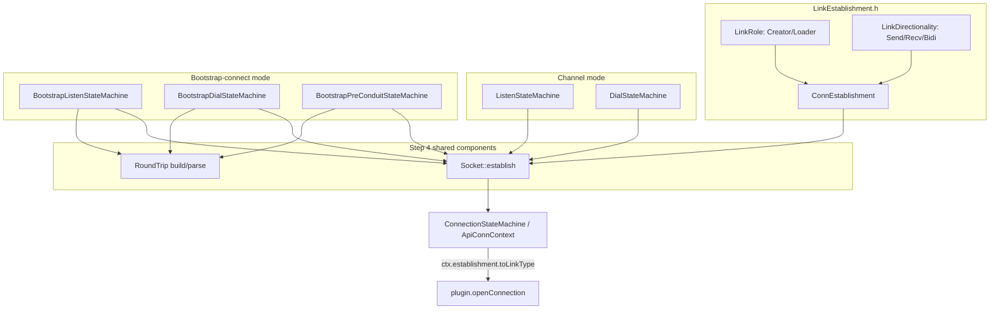

# State Machine Refactor: Branch Summary (`refactoring-state-machines`)

This summarizes the 4-step migration performed on this branch plus a
follow-up pass applying the suggested next steps (commits `1cad2f9`..`152b169`,
on top of `integration-testing`), the resulting architecture, what's now
fixed, what's still rough, and suggested next steps. Read alongside
`link-management.md` (the original architectural analysis that motivated
this branch) and `Step1.md`-`Step4.md` (per-step detail, build/test
evidence).

## Follow-up: suggested next steps applied (commit `152b169`)

After the initial 4-step migration, the following next steps (below) were
applied and verified against the full regression suite:

1. **Closed the dialer-side transition gap.** Added the symmetric
   `EVENT_CONN_STATE_MACHINE_LINK_ESTABLISHED` self-loop to
   `BootstrapDialStateEngine`'s `STATE_BOOTSTRAP_DIAL_WAITING_FOR_CONNECTIONS`
   and `STATE_BOOTSTRAP_DIAL_WAITING_FOR_FINAL_CONNECTIONS`, matching the fix
   already applied to the listener side in Step 3.
2. **Centralized role resolution.** Added `resolveBidiRole(ModeRole)` to
   `LinkEstablishment.h` (`ModeRole::Listener` -> `LinkRole::Creator`,
   `ModeRole::Dialer` -> `LinkRole::Loader`) and replaced the 6 call sites
   that were hardcoding this LD_BIDI tie-break convention with calls into it.
   The one `LinkRole::Loader` literal that was NOT a tie-break case (the
   "reuse an existing link" call in `ListenStateMachine.cpp`'s multi-accept
   path) was deliberately left as a literal - it isn't resolving creator vs.
   loader for an ambiguous channel, it's inherently a loader regardless of
   channel type.
3. **Finished routing every remaining directional call site through
   `Socket::establish`.** All ~21 previously-direct
   `ctx.manager.startConnStateMachine(...)` calls across
   `BootstrapListenStateMachine.cpp`/`BootstrapDialStateMachine.cpp`/
   `BootstrapPreConduitStateMachine.cpp` (including dead-code branches, for
   consistency) now go through `Socket::establish`, tagged with an explicit
   `slot` ("initial"/"final") argument.
4. **Fixed `link_topology.py`'s same-channel-gid blind spot.**
   `Socket::establish` now logs a structured, slot-tagged line
   (`Socket::establish: slot=... channel=... role=... directionality=...`);
   `link_topology.py` gained `count_socket_establish_events()` to parse it,
   and `check_final_link_topology` now uses this slot-tagged count as its
   primary source (falling back to the old channelGid-keyed heuristic, with
   `[SKIPPED]`, only for logs that predate this instrumentation). **Result:
   the two previously-`[SKIPPED]` scenarios
   (`bootstrap-decomposed-decomposed(-multi-client)`,
   `bootstrap-racebird-racebird(-multi-client)`) now get real `[OK]`
   assertions instead.**
6. **Soak-tested combo 1.** Re-ran `bootstrap-racebird-racebird-multi-client`
   3 additional times this session (on top of the runs from Step 3/4); all
   passed consistently (~46s each).

**Deliberately not applied**: next step #5 (the literal state-machine-class
collapse) remains unimplemented, per its own explicit "optional/lower
priority" framing - it was not requested and the concrete problems it would
solve (combo 1, code duplication) are already resolved.

All 10 integration scenarios were re-verified fresh after this follow-up
pass and now **all show `[OK]`** (zero remaining `[SKIPPED]` verdicts).

## Why this branch exists

Prior sessions kept re-discovering the same bug shape across three
independent, hand-copied "establish a link and decide who creates it"
implementations (plain channel mode, bootstrap initial slot, bootstrap final
slot), because the role-blind helpers `shouldCreateSender`/
`shouldCreateReceiver` cannot resolve creator-vs-loader for `LD_BIDI`
channels, and because bootstrap's "merged" links were faked via two
directional connections aliased together rather than a real bidirectional
connection. That second issue was the confirmed root cause of "combo 1"
(`bootstrap-racebird-racebird`, i.e. racebird used as both the bootstrap
initial and final channel), which had been broken across multiple prior
sessions and is now fixed.

## What changed, step by step

**Step 1 - Introduce the primitives** (`LinkEstablishment.h`, new):
- `LinkRole { Creator, Loader }`, `LinkDirectionality { Send, Recv, Bidi }`,
  and `ConnEstablishment { role, directionality }` with `isCreator()`/
  `isBidi()`/`isSend()`/`toLinkType()` and `fromLegacy(creating, sending,
  bidirectional)` for behavior-preserving migration.
- `ConnectionStateMachine.{h,cpp}` (`ApiConnContext`) now populates and
  consults `ctx.establishment` instead of raw `create`/`send`/`bidirectional`
  bools at the two places that actually make decisions
  (`StateConnActivated`, `StateConnLinkEstablished`). Legacy bools are still
  present (read elsewhere) - not removed.

**Step 2 - Migrate channel mode** (`ListenStateMachine.cpp`,
`DialStateMachine.cpp`): every `startConnStateMachine`/
`startConnStateMachineBidi` call site's previously-hardcoded `true`/`false`
literals are now expressed as named `ConnEstablishment{LinkRole::.., 
LinkDirectionality::..}` values. Purely mechanical/naming; the manager
interface itself was untouched.

**Step 3 - Unify bootstrap's merge mechanism** (`BootstrapListenStateMachine.cpp`,
`BootstrapDialStateMachine.cpp`, `BootstrapPreConduitStateMachine.cpp`):
replaced the "start one directional `startConnStateMachine` connection, then
manually alias `xRecvConnSMHandle = xSendConnSMHandle`" hack with genuine
`startConnStateMachineBidi` calls for every merged init/final link. This
also required adding a previously-missing state transition
(`STATE_BOOTSTRAP_PRE_CONN_OBJ_WAITING_FOR_CONNECTIONS` +
`EVENT_CONN_STATE_MACHINE_LINK_ESTABLISHED` self-loop) - the same fix a
prior session had reverted (it caused regressions against the *old*
aliased mechanism), safe now that the merge mechanism is unified.
**This step fixed combo 1** (both single- and multi-client variants).

**Step 4 - `Socket`/`RoundTrip` composition** (`Socket.h`, `RoundTrip.h`,
new): consolidated the two remaining duplicated concerns into shared,
instantiated helper components (not new state-machine/context types -
see Step4.md for why the literal class-hierarchy version was scoped down):
- `Socket::establish(manager, handle, SocketRequest)` - the one call site
  every merged-link establishment now goes through instead of each caller
  manually choosing between `startConnStateMachineBidi`/
  `startConnStateMachine`.
- `RoundTrip::buildMessage`/`parseMessage`/`extractPayload`/
  `encodePackageIdField`/`decodePackageIdField` - the hello/response wire
  framing (routing-prefix + JSON + base64 packageId/payload), previously
  hand-built/hand-parsed independently in 4 places, now one implementation.

## Current architecture (end state of this branch)

- **Every** link/connection establishment call site (channel-mode and
  bootstrap-mode, merged and non-merged) ultimately expresses its
  create/load-and-direction decision as a `ConnEstablishment` value.
- **Every merged (Bidi) link**, whether it's a plain channel or a bootstrap
  initial/final slot, now genuinely produces an `LT_BIDI` connection at the
  plugin API surface via `startConnStateMachineBidi` - there is no more
  "secretly `LT_SEND`" case.
- **The hello/response wire protocol is unchanged** (byte-for-byte) but its
  construction/parsing is no longer duplicated.
- `shouldCreateSender`/`shouldCreateReceiver`/`shouldUseSingleBidiLink`
  (`ApiContext.cpp`) are **unchanged** - still role-blind for `LD_BIDI`
  channels, still valid/correct for genuinely asymmetric
  `LD_CREATOR_TO_LOADER`/`LD_LOADER_TO_CREATOR` channels. The `LD_BIDI`
  tie-break itself is now resolved by the new, centralized
  `resolveBidiRole(ModeRole)` function (`LinkEstablishment.h`) rather than a
  literal `LinkRole::Creator`/`Loader` hardcoded independently at each of
  the 6 merged-link call sites.
- **Every** connection-establishment call site across channel mode and
  bootstrap mode (merged and non-merged, ~28 call sites total) now goes
  through `Socket::establish`, tagged with an explicit `slot`
  ("channel"/"initial"/"final") argument used for test-log attribution.

## Validated test coverage

All 10 integration scenarios under `test/integration/scenarios/` pass as of
`152b169` (each re-run fresh, not assumed from a prior step), and **all now
show real `[OK]` topology assertions - zero `[SKIPPED]` verdicts remain**:

| Scenario | Initial/final channels | Status |
|---|---|---|
| `racebird-client-connect` | channel mode, racebird | PASS |
| `decomposed-client-connect(-multi-client)` | channel mode, decomposed | PASS |
| `bootstrap-decomposed-racebird` | decomposed / racebird | PASS (topology: OK) |
| `bootstrap-racebird-multi-client` | decomposed / racebird, multi-client | PASS (topology: OK) |
| `bootstrap-racebird-decomposed(-multi-client)` | racebird / decomposed | PASS (topology: OK) |
| `bootstrap-decomposed-decomposed(-multi-client)` | decomposed / decomposed | PASS (topology: OK - previously SKIPPED) |
| `bootstrap-racebird-racebird(-multi-client)` | racebird / racebird ("combo 1") | **PASS (topology: OK) - previously broken across multiple sessions, soak-tested 5x this session** |

## Remaining problem areas

1. ~~Dialer-side latent transition gap.~~ **Resolved.** Symmetric
   `EVENT_CONN_STATE_MACHINE_LINK_ESTABLISHED` self-loops added to
   `BootstrapDialStateEngine`'s two waiting states.
2. ~~`link_topology.py` can't verify same-channel-gid scenarios.~~
   **Resolved.** `Socket::establish` now emits a slot-tagged structured log
   line; `check_final_link_topology` uses it as the primary count source,
   eliminating the `[SKIPPED]` verdict for same-gid scenarios (falls back to
   the old heuristic only for logs predating this instrumentation).
3. ~~Role decision is still hardcoded per call site, not centralized.~~
   **Resolved for the `LD_BIDI` tie-break** via `resolveBidiRole(ModeRole)`.
   Note this is narrower than `link-management.md` §5.1's full proposal
   (a `resolveRole(ChannelProperties, ModeRole)` that also subsumes the
   already-correct `LD_CREATOR_TO_LOADER`/`LD_LOADER_TO_CREATOR` resolution
   via `shouldCreateSender`/`shouldCreateReceiver`) - those two paths remain
   separate call sites rather than one unified function. Low priority to
   unify further since both paths are independently correct today.
4. ~~Non-merged directional call sites are inconsistent in style.~~
   **Resolved.** Every remaining direct `ctx.manager.startConnStateMachine(...)`
   call site (including dead-code branches) now goes through
   `Socket::establish`.
5. **`Socket`/`RoundTrip` are helper functions, not state-machine instances.**
   Per Step4.md, a literal replacement of the three bootstrap `StateEngine`/
   `Context` class hierarchies with instances of new, generic `Socket`/
   `RoundTrip` state machines was scoped down to avoid touching
   `ApiManager`'s shared dispatch core. The organizational/duplication
   problem is resolved either way, but the "three separate classes with
   near-identical state-transition tables" structural duplication (as
   opposed to logic duplication, which *is* resolved) still exists in
   `BootstrapListenStateMachine.cpp`/`BootstrapDialStateMachine.cpp`/
   `BootstrapPreConduitStateMachine.cpp`'s state tables themselves.
6. **Combo 1's fix is now soak-tested within this session, not across
   sessions or with larger client counts.** Both single- and multi-client
   `bootstrap-racebird-racebird` variants have now passed reliably across 5
   repeated runs total this session, but no long-running/overnight soak
   testing or larger client counts (3+) have been tried against the new
   Bidi-merged final-link path.

## Suggested next steps (remaining, in rough priority order)

1. **Consider the literal state-machine collapse** (problem #5) only as a
   deliberate, separately-scoped follow-up, per Step4.md's guidance: extend
   `ApiManager`'s dispatch core to support generic `Socket`/`RoundTrip`
   context/engine types first, then migrate one bootstrap file at a time,
   each gated by the full suite. Given this area's demonstrated fragility
   (Step 3's revert history), treat as optional/lower priority now that the
   concrete bug (combo 1) and the duplication concern are both resolved.
2. **Extend soak-testing of combo 1** (problem #6) across sessions and with
   3+ simulated clients, and consider adding a dedicated 3-client scenario
   file to the permanent suite rather than only ad hoc repeated runs.
3. **Optionally unify the `LD_BIDI` tie-break and the
   `LD_CREATOR_TO_LOADER`/`LD_LOADER_TO_CREATOR` resolution paths** (problem
   #3's residual note) into a single `resolveRole(ChannelProperties,
   ModeRole)` function per `link-management.md` §5.1's full proposal - purely
   cosmetic/organizational at this point, since both paths are already
   independently correct.
