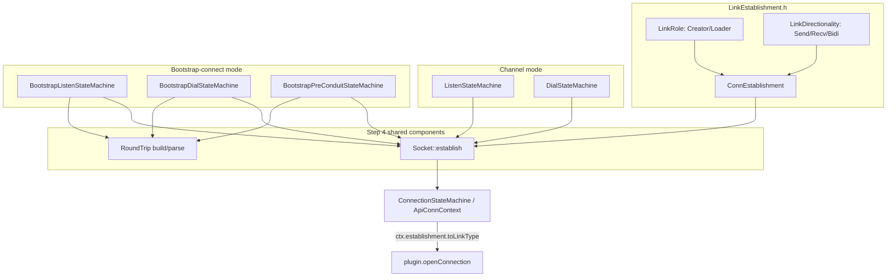

# State Machine Refactor: Branch Summary (`refactoring-state-machines`)

This summarizes the 4-step migration performed on this branch (commits
`1cad2f9`..`9c0bf4c`, on top of `integration-testing`), the resulting
architecture, what's now fixed, what's still rough, and suggested next
steps. Read alongside `link-management.md` (the original architectural
analysis that motivated this branch) and `Step1.md`-`Step4.md` (per-step
detail, build/test evidence).

## Why this branch exists

Prior sessions kept re-discovering the same bug shape across three
independent, hand-copied "establish a link and decide who creates it"
implementations (plain channel mode, bootstrap initial slot, bootstrap final
slot), because the role-blind helpers `shouldCreateSender`/
`shouldCreateReceiver` cannot resolve creator-vs-loader for `LD_BIDI`
channels, and because bootstrap's "merged" links were faked via two
directional connections aliased together rather than a real bidirectional
connection. That second issue was the confirmed root cause of "combo 1"
(`bootstrap-racebird-racebird`, i.e. racebird used as both the bootstrap
initial and final channel), which had been broken across multiple prior
sessions and is now fixed.

## What changed, step by step

**Step 1 - Introduce the primitives** (`LinkEstablishment.h`, new):
- `LinkRole { Creator, Loader }`, `LinkDirectionality { Send, Recv, Bidi }`,
  and `ConnEstablishment { role, directionality }` with `isCreator()`/
  `isBidi()`/`isSend()`/`toLinkType()` and `fromLegacy(creating, sending,
  bidirectional)` for behavior-preserving migration.
- `ConnectionStateMachine.{h,cpp}` (`ApiConnContext`) now populates and
  consults `ctx.establishment` instead of raw `create`/`send`/`bidirectional`
  bools at the two places that actually make decisions
  (`StateConnActivated`, `StateConnLinkEstablished`). Legacy bools are still
  present (read elsewhere) - not removed.

**Step 2 - Migrate channel mode** (`ListenStateMachine.cpp`,
`DialStateMachine.cpp`): every `startConnStateMachine`/
`startConnStateMachineBidi` call site's previously-hardcoded `true`/`false`
literals are now expressed as named `ConnEstablishment{LinkRole::.., 
LinkDirectionality::..}` values. Purely mechanical/naming; the manager
interface itself was untouched.

**Step 3 - Unify bootstrap's merge mechanism** (`BootstrapListenStateMachine.cpp`,
`BootstrapDialStateMachine.cpp`, `BootstrapPreConduitStateMachine.cpp`):
replaced the "start one directional `startConnStateMachine` connection, then
manually alias `xRecvConnSMHandle = xSendConnSMHandle`" hack with genuine
`startConnStateMachineBidi` calls for every merged init/final link. This
also required adding a previously-missing state transition
(`STATE_BOOTSTRAP_PRE_CONN_OBJ_WAITING_FOR_CONNECTIONS` +
`EVENT_CONN_STATE_MACHINE_LINK_ESTABLISHED` self-loop) - the same fix a
prior session had reverted (it caused regressions against the *old*
aliased mechanism), safe now that the merge mechanism is unified.
**This step fixed combo 1** (both single- and multi-client variants).

**Step 4 - `Socket`/`RoundTrip` composition** (`Socket.h`, `RoundTrip.h`,
new): consolidated the two remaining duplicated concerns into shared,
instantiated helper components (not new state-machine/context types -
see Step4.md for why the literal class-hierarchy version was scoped down):
- `Socket::establish(manager, handle, SocketRequest)` - the one call site
  every merged-link establishment now goes through instead of each caller
  manually choosing between `startConnStateMachineBidi`/
  `startConnStateMachine`.
- `RoundTrip::buildMessage`/`parseMessage`/`extractPayload`/
  `encodePackageIdField`/`decodePackageIdField` - the hello/response wire
  framing (routing-prefix + JSON + base64 packageId/payload), previously
  hand-built/hand-parsed independently in 4 places, now one implementation.

## Current architecture (end state of this branch)

- **Every** link/connection establishment call site (channel-mode and
  bootstrap-mode, merged and non-merged) ultimately expresses its
  create/load-and-direction decision as a `ConnEstablishment` value.
- **Every merged (Bidi) link**, whether it's a plain channel or a bootstrap
  initial/final slot, now genuinely produces an `LT_BIDI` connection at the
  plugin API surface via `startConnStateMachineBidi` - there is no more
  "secretly `LT_SEND`" case.
- **The hello/response wire protocol is unchanged** (byte-for-byte) but its
  construction/parsing is no longer duplicated.
- `shouldCreateSender`/`shouldCreateReceiver`/`shouldUseSingleBidiLink`
  (`ApiContext.cpp`) are **unchanged** - still role-blind for `LD_BIDI`
  channels, still valid/correct for genuinely asymmetric
  `LD_CREATOR_TO_LOADER`/`LD_LOADER_TO_CREATOR` channels. Every place that
  needed to resolve the `LD_BIDI` tie-break already had a hardcoded
  role-based constant (`LinkRole::Creator` for listener, `LinkRole::Loader`
  for dialer) predating this branch; that hardcoding is now expressed via
  `ConnEstablishment` literals instead of bare `true`/`false`, but the
  *decision logic itself* was not centralized into a single `resolveRole()`
  function this round (see "Next steps" below).

## Validated test coverage

All 10 integration scenarios under `test/integration/scenarios/` pass as of
`9c0bf4c` (each re-run fresh, not assumed from a prior step):

| Scenario | Initial/final channels | Status |
|---|---|---|
| `racebird-client-connect` | channel mode, racebird | PASS |
| `decomposed-client-connect(-multi-client)` | channel mode, decomposed | PASS |
| `bootstrap-decomposed-racebird` | decomposed / racebird | PASS |
| `bootstrap-racebird-multi-client` | decomposed / racebird, multi-client | PASS |
| `bootstrap-racebird-decomposed(-multi-client)` | racebird / decomposed | PASS |
| `bootstrap-decomposed-decomposed(-multi-client)` | decomposed / decomposed | PASS (topology check SKIPPED, see below) |
| `bootstrap-racebird-racebird(-multi-client)` | racebird / racebird ("combo 1") | **PASS - previously broken across multiple sessions** |

## Remaining problem areas

1. **Dialer-side latent transition gap.** `BootstrapDialStateEngine`'s
   `STATE_BOOTSTRAP_DIAL_WAITING_FOR_CONNECTIONS`/
   `STATE_BOOTSTRAP_DIAL_WAITING_FOR_FINAL_CONNECTIONS` states have the same
   missing-`LINK_ESTABLISHED`-transition pattern that was fixed on the
   listener side in Step 3. It hasn't caused a failure in any of the 10
   scenarios because the dialer's own `CONNECTED` event already satisfies
   its wait gates first, but it's a latent gap, not a proven-safe absence.
2. **`link_topology.py` can't verify same-channel-gid scenarios.** When
   initial and final slots use the same channel (the `bootstrap-*-decomposed-
   decomposed*` and `bootstrap-racebird-racebird*` scenarios), the checker
   emits `[SKIPPED]` rather than asserting exact create/load counts, because
   initial-slot link-reuse events and final-slot events land in the same
   log bucket. This is a test-tooling gap, not known to hide a product bug,
   but it does mean these scenarios have weaker verification than the
   others.
3. **Role decision is still hardcoded per call site, not centralized.**
   Every `LD_BIDI` tie-break (`ConnEstablishment{LinkRole::Creator, ...}` on
   the listener, `{LinkRole::Loader, ...}` on the dialer) is still a literal
   written at each of ~9 call sites rather than derived from one
   `resolveRole(role_in_mode, channel_properties)`-style function. This
   matches `link-management.md` §5.1's original recommendation, which this
   branch did not implement - see "Next steps."
4. **Non-merged directional call sites are inconsistent in style.** Some
   (`BootstrapDialStateMachine.cpp`'s `StateBootstrapDialRecvResponse`) were
   incidentally routed through `Socket::establish` while doing other work in
   the same function; most others (`init_recv`, non-merged `final_send`/
   `final_recv` create-or-load pairs) were deliberately left as direct
   `ctx.manager.startConnStateMachine(...)` calls (Step 4 scope decision).
   This is a stylistic inconsistency, not a bug, but a future pass could
   finish routing every call site through `Socket::establish` for
   uniformity.
5. **`Socket`/`RoundTrip` are helper functions, not state-machine instances.**
   Per Step4.md, a literal replacement of the three bootstrap `StateEngine`/
   `Context` class hierarchies with instances of new, generic `Socket`/
   `RoundTrip` state machines was scoped down to avoid touching
   `ApiManager`'s shared dispatch core. The organizational/duplication
   problem is resolved either way, but the "three separate classes with
   near-identical state-transition tables" structural duplication (as
   opposed to logic duplication, which *is* resolved) still exists in
   `BootstrapListenStateMachine.cpp`/`BootstrapDialStateMachine.cpp`/
   `BootstrapPreConduitStateMachine.cpp`'s state tables themselves.
6. **Combo 1's fix was validated functionally, not stress-tested.** Both
   single- and multi-client `bootstrap-racebird-racebird` variants pass
   reliably across multiple runs this session, but only this session -
   no long-running/soak testing or larger client counts (3+) have been
   tried against the new Bidi-merged final-link path.

## Suggested next steps (in rough priority order)

1. **Close the dialer-side transition gap** (problem #1) - add the
   symmetric `EVENT_CONN_STATE_MACHINE_LINK_ESTABLISHED` self-loop to
   `BootstrapDialStateEngine`'s two waiting states, gated behind the full
   regression suite, to remove the latent risk proactively rather than
   waiting for a scenario to surface it.
2. **Centralize role resolution** (problem #3): introduce a
   `resolveRole(ChannelProperties, ModeRole)`-style function per
   `link-management.md` §5.1, replacing the ~9 literal
   `ConnEstablishment{LinkRole::Creator/Loader, ...}` call sites with calls
   into it. Lower risk than Steps 1-4 since it's a pure refactor of already-
   correct hardcoded values into one function, verifiable the same way.
3. **Fix `link_topology.py`'s same-gid blind spot** (problem #2), per
   `link-management.md` §5.3 (thread a slot name into the create/load debug
   lines, or emit one structured summary line per link from a central
   place) - this is test-infrastructure work, independent of SDK behavior
   changes, and would let same-channel-gid scenarios get real assertions
   instead of `[SKIPPED]`.
4. **Finish routing non-merged call sites through `Socket::establish`**
   (problem #4) for uniformity - cosmetic, no urgency.
5. **Consider the literal state-machine collapse** (problem #5) only as a
   deliberate, separately-scoped follow-up, per Step4.md's guidance: extend
   `ApiManager`'s dispatch core to support generic `Socket`/`RoundTrip`
   context/engine types first, then migrate one bootstrap file at a time,
   each gated by the full suite. Given this area's demonstrated fragility
   (Step 3's revert history), treat as optional/lower priority now that the
   concrete bug (combo 1) and the duplication concern are both resolved.
6. **Soak/stress-test combo 1** (problem #6) - run `bootstrap-racebird-
   racebird-multi-client` repeatedly and with more simulated clients before
   treating it as production-hardened, not just "passes once."
